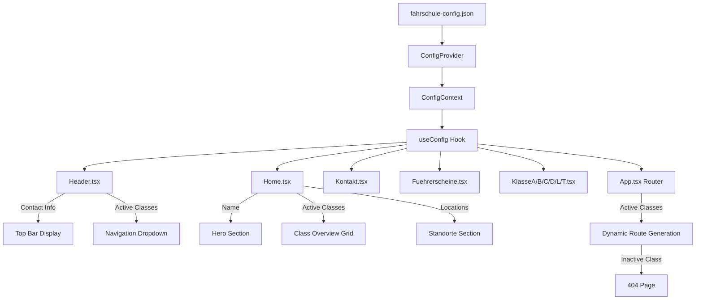

# Fahrschule Website Configuration Architecture

## Overview

This document describes the JSON-based configuration system for the driving school website. The configuration file (`fahrschule-config.json`) in the root directory controls all customer-specific data while keeping generic text content (descriptions, FAQ, etc.) unchanged.

## Analysis Summary

### Current Hardcoded Values Identified

| Component | Hardcoded Values |
|-----------|------------------|
| [`Header.tsx`](../src/components/Header.tsx:1) | Phone: `0123 456789`, Email: `info@fuehrerschein.de`, Location: `Berlin`, Navigation menu items |
| [`Home.tsx`](../src/pages/Home.tsx:1) | Hero subtitle: `Platzhalter Fahrschule`, Locations array with addresses/phones/hours |
| [`Kontakt.tsx`](../src/pages/Kontakt.tsx:1) | Locations array with Berlin addresses |
| [`Kontaktinformationen.tsx`](../src/components/Kontaktinformationen.tsx:1) | Locations array (Berlin, Hamburg), Email: `info@fahrschule.de` |
| [`Fuehrerscheine.tsx`](../src/pages/Fuehrerscheine.tsx:1) | All 6 main classes with 19 subclasses in tabs array |
| [`KlassenUebersichtGridSpotlight.tsx`](../src/components/KlassenUebersichtGridSpotlight.tsx:1) | All 6 class cards with links |
| [`KlasseA.tsx`](../src/pages/KlasseA.tsx:1) | 4 subclasses: AM, A1, A2, A |
| [`KlasseB.tsx`](../src/pages/KlasseB.tsx:1) | 5 subclasses: B, BE, BF17, B96, B197 |
| [`App.tsx`](../src/App.tsx:1) | Static routes for all 6 class pages |

### License Class Hierarchy

```
Main Classes (Oberklassen):
├── A (Motorrad/Motorcycle)
│   ├── AM - Kleinkrafträder/Mofas bis 45 km/h
│   ├── A1 - Leichtkrafträder bis 125 ccm / 11 kW
│   ├── A2 - Motorräder bis 35 kW
│   └── A  - Alle Motorräder ohne Beschränkung
│
├── B (PKW/Car)
│   ├── BF17 - Begleitetes Fahren ab 17
│   ├── B   - PKW bis 3,5 t
│   ├── B96 - PKW + Anhänger bis 4,25 t (nur Schulung)
│   ├── BE  - PKW + Anhänger > 750 kg
│   ├── B196 - Erweiterung für 125ccm Motorräder (nur DE)
│   └── B197 - Automatik mit Schaltkompetenz
│
├── C (LKW/Truck)
│   ├── C1  - 3,5 - 7,5 t
│   ├── C1E - C1 + Anhänger > 750 kg
│   ├── C   - > 3,5 t
│   └── CE  - C + Anhänger > 750 kg
│
├── D (Bus)
│   ├── D1  - 9-16 Sitzplätze, max. 8 m
│   ├── D1E - D1 + Anhänger > 750 kg
│   ├── D   - Bus > 8 Sitzplätze
│   └── DE  - D + Anhänger > 750 kg
│
├── L (Landwirtschaft/Agricultural)
│   └── L   - Zugmaschinen bis 40 km/h
│
└── T (Landwirtschaft/Agricultural)
    └── T   - Zugmaschinen bis 60 km/h
```

---

## JSON Configuration Schema

### Complete Schema

```json
{
  "$schema": "http://json-schema.org/draft-07/schema#",
  "title": "Fahrschule Configuration",
  "type": "object",
  "required": ["fahrschule", "standorte", "fuehrerscheinklassen"],
  "properties": {
    "fahrschule": {
      "type": "object",
      "required": ["name", "kontakt"],
      "properties": {
        "name": { "type": "string", "description": "Name der Fahrschule" },
        "logo": { "type": "string", "description": "Pfad zum Logo (optional, default: /default_images/logo_default.webp)" },
        "kontakt": {
          "type": "object",
          "required": ["telefon", "email"],
          "properties": {
            "telefon": { "type": "string" },
            "email": { "type": "string", "format": "email" }
          }
        }
      }
    },
    "standorte": {
      "type": "array",
      "minItems": 1,
      "items": {
        "type": "object",
        "required": ["id", "name", "adresse", "telefon", "oeffnungszeiten", "googleMapsUrl"],
        "properties": {
          "id": { "type": "string", "description": "Eindeutige ID für den Standort" },
          "name": { "type": "string", "description": "Anzeigename des Standorts" },
          "adresse": { "type": "string" },
          "telefon": { "type": "string" },
          "email": { "type": "string", "format": "email", "description": "Optional, falls abweichend" },
          "oeffnungszeiten": { "type": "string", "description": "Mehrzeilig mit \\n" },
          "googleMapsUrl": { "type": "string", "format": "uri" },
          "istHauptstandort": { "type": "boolean", "default": false }
        }
      }
    },
    "fuehrerscheinklassen": {
      "type": "object",
      "properties": {
        "A": {
          "type": "object",
          "properties": {
            "aktiv": { "type": "boolean" },
            "unterklassen": {
              "type": "array",
              "items": { "type": "string", "enum": ["AM", "A1", "A2", "A"] }
            }
          }
        },
        "B": {
          "type": "object",
          "properties": {
            "aktiv": { "type": "boolean" },
            "unterklassen": {
              "type": "array",
              "items": { "type": "string", "enum": ["BF17", "B", "B96", "BE", "B196", "B197"] }
            }
          }
        },
        "C": {
          "type": "object",
          "properties": {
            "aktiv": { "type": "boolean" },
            "unterklassen": {
              "type": "array",
              "items": { "type": "string", "enum": ["C1", "C1E", "C", "CE"] }
            }
          }
        },
        "D": {
          "type": "object",
          "properties": {
            "aktiv": { "type": "boolean" },
            "unterklassen": {
              "type": "array",
              "items": { "type": "string", "enum": ["D1", "D1E", "D", "DE"] }
            }
          }
        },
        "L": {
          "type": "object",
          "properties": {
            "aktiv": { "type": "boolean" },
            "unterklassen": {
              "type": "array",
              "items": { "type": "string", "enum": ["L"] }
            }
          }
        },
        "T": {
          "type": "object",
          "properties": {
            "aktiv": { "type": "boolean" },
            "unterklassen": {
              "type": "array",
              "items": { "type": "string", "enum": ["T"] }
            }
          }
        }
      }
    }
  }
}
```

---

## Example Configurations

### Full Configuration (Current Website State)

```json
{
  "fahrschule": {
    "name": "Platzhalter Fahrschule",
    "logo": "/default_images/logo_default.webp",
    "kontakt": {
      "telefon": "0123 456789",
      "email": "info@fuehrerschein.de"
    }
  },
  "standorte": [
    {
      "id": "hauptstandort",
      "name": "Hauptstandort",
      "adresse": "Musterstraße 123, 12345 Musterstadt",
      "telefon": "+49 123 456789",
      "oeffnungszeiten": "Mo-Fr: 8:00-18:00\nSa: 9:00-14:00\nSo: Geschlossen",
      "googleMapsUrl": "https://maps.google.com/maps?q=Musterstra%C3%9Fe%20123,%2012345%20Musterstadt&t=&z=15&ie=UTF8&iwloc=&output=embed",
      "istHauptstandort": true
    },
    {
      "id": "zweigstelle-nord",
      "name": "Zweigstelle Nord",
      "adresse": "Nordstraße 456, 54321 Nordstadt",
      "telefon": "+49 987 654321",
      "oeffnungszeiten": "Mo-Fr: 9:00-17:00\nSa: 10:00-15:00\nSo: Geschlossen",
      "googleMapsUrl": "https://maps.google.com/maps?q=Nordstra%C3%9Fe%20456,%2054321%20Nordstadt&t=&z=15&ie=UTF8&iwloc=&output=embed",
      "istHauptstandort": false
    }
  ],
  "fuehrerscheinklassen": {
    "A": {
      "aktiv": true,
      "unterklassen": ["AM", "A1", "A2", "A"]
    },
    "B": {
      "aktiv": true,
      "unterklassen": ["BF17", "B", "B96", "BE", "B196", "B197"]
    },
    "C": {
      "aktiv": true,
      "unterklassen": ["C1", "C1E", "C", "CE"]
    },
    "D": {
      "aktiv": true,
      "unterklassen": ["D1", "D1E", "D", "DE"]
    },
    "L": {
      "aktiv": true,
      "unterklassen": ["L"]
    },
    "T": {
      "aktiv": true,
      "unterklassen": ["T"]
    }
  }
}
```

### Minimal Configuration (Only A + B Classes)

This example shows a driving school that only offers motorcycle (A) and car (B) licenses:

```json
{
  "fahrschule": {
    "name": "Fahrschule Müller",
    "kontakt": {
      "telefon": "+49 30 12345678",
      "email": "info@fahrschule-mueller.de"
    }
  },
  "standorte": [
    {
      "id": "berlin-mitte",
      "name": "Berlin-Mitte",
      "adresse": "Hauptstraße 1, 10115 Berlin",
      "telefon": "+49 30 12345678",
      "oeffnungszeiten": "Mo-Fr: 9-18 Uhr\nSa: 10-14 Uhr",
      "googleMapsUrl": "https://maps.google.com/maps?q=Hauptstra%C3%9Fe%201,%2010115%20Berlin&t=&z=15&ie=UTF8&iwloc=&output=embed",
      "istHauptstandort": true
    }
  ],
  "fuehrerscheinklassen": {
    "A": {
      "aktiv": true,
      "unterklassen": ["A1", "A2", "A"]
    },
    "B": {
      "aktiv": true,
      "unterklassen": ["BF17", "B", "BE"]
    },
    "C": {
      "aktiv": false,
      "unterklassen": []
    },
    "D": {
      "aktiv": false,
      "unterklassen": []
    },
    "L": {
      "aktiv": false,
      "unterklassen": []
    },
    "T": {
      "aktiv": false,
      "unterklassen": []
    }
  }
}
```

**Result with this configuration:**
- Header dropdown shows only: Übersicht, Klasse A, Klasse B
- Home page shows only 2 class cards (A and B)
- Routes `/fuehrerscheine/klasse-c`, `/klasse-d`, `/klasse-l`, `/klasse-t` redirect to 404
- Fuehrerscheine overview shows only 2 tabs
- KlasseA page shows only A1, A2, A (no AM)
- KlasseB page shows only BF17, B, BE (no B96, B196, B197)

---

## Implementation Architecture

### Data Flow Diagram



### File Structure

```
src/
├── config/
│   ├── types.ts              # TypeScript interfaces
│   ├── ConfigContext.tsx     # React Context Provider
│   ├── useConfig.ts          # Custom hook
│   └── classData.ts          # Static class descriptions/metadata
├── components/
│   ├── Header.tsx            # Updated to use config
│   ├── KlassenUebersichtGridSpotlight.tsx  # Updated
│   ├── StandorteUebersicht.tsx             # Updated
│   └── Kontaktinformationen.tsx            # Updated
├── pages/
│   ├── Home.tsx              # Updated
│   ├── Kontakt.tsx           # Updated
│   ├── Fuehrerscheine.tsx    # Updated
│   ├── KlasseA.tsx           # Updated (filters subclasses)
│   ├── KlasseB.tsx           # Updated
│   ├── KlasseC.tsx           # Updated
│   ├── KlasseD.tsx           # Updated
│   ├── KlasseL.tsx           # Updated
│   └── KlasseT.tsx           # Updated
└── App.tsx                   # Dynamic routing
```

### TypeScript Interfaces

```typescript
// src/config/types.ts

export interface FahrschuleKontakt {
  telefon: string;
  email: string;
}

export interface Fahrschule {
  name: string;
  logo?: string;
  kontakt: FahrschuleKontakt;
}

export interface Standort {
  id: string;
  name: string;
  adresse: string;
  telefon: string;
  email?: string;
  oeffnungszeiten: string;
  googleMapsUrl: string;
  istHauptstandort?: boolean;
}

export type HauptklasseCode = 'A' | 'B' | 'C' | 'D' | 'L' | 'T';

export type UnterklasseA = 'AM' | 'A1' | 'A2' | 'A';
export type UnterklasseB = 'BF17' | 'B' | 'B96' | 'BE' | 'B196' | 'B197';
export type UnterklasseC = 'C1' | 'C1E' | 'C' | 'CE';
export type UnterklasseD = 'D1' | 'D1E' | 'D' | 'DE';
export type UnterklasseL = 'L';
export type UnterklasseT = 'T';

export type Unterklasse = UnterklasseA | UnterklasseB | UnterklasseC | UnterklasseD | UnterklasseL | UnterklasseT;

export interface Fuehrerscheinklasse {
  aktiv: boolean;
  unterklassen: string[];
}

export interface Fuehrerscheinklassen {
  A: Fuehrerscheinklasse;
  B: Fuehrerscheinklasse;
  C: Fuehrerscheinklasse;
  D: Fuehrerscheinklasse;
  L: Fuehrerscheinklasse;
  T: Fuehrerscheinklasse;
}

export interface FahrschuleConfig {
  fahrschule: Fahrschule;
  standorte: Standort[];
  fuehrerscheinklassen: Fuehrerscheinklassen;
}
```

### Config Context Provider

```typescript
// src/config/ConfigContext.tsx

import React, { createContext, useContext, useState, useEffect, ReactNode } from 'react';
import { FahrschuleConfig, HauptklasseCode } from './types';

interface ConfigContextType {
  config: FahrschuleConfig | null;
  loading: boolean;
  error: string | null;
  isClassActive: (hauptklasse: HauptklasseCode) => boolean;
  isSubclassActive: (hauptklasse: HauptklasseCode, unterklasse: string) => boolean;
  getActiveClasses: () => HauptklasseCode[];
  getActiveSubclasses: (hauptklasse: HauptklasseCode) => string[];
  getPrimaryLocation: () => Standort | undefined;
}

const ConfigContext = createContext<ConfigContextType | undefined>(undefined);

export const ConfigProvider: React.FC<{ children: ReactNode }> = ({ children }) => {
  const [config, setConfig] = useState<FahrschuleConfig | null>(null);
  const [loading, setLoading] = useState(true);
  const [error, setError] = useState<string | null>(null);

  useEffect(() => {
    fetch('/fahrschule-config.json')
      .then(res => res.json())
      .then(data => {
        setConfig(data);
        setLoading(false);
      })
      .catch(err => {
        setError(err.message);
        setLoading(false);
      });
  }, []);

  const isClassActive = (hauptklasse: HauptklasseCode): boolean => {
    return config?.fuehrerscheinklassen[hauptklasse]?.aktiv ?? false;
  };

  const isSubclassActive = (hauptklasse: HauptklasseCode, unterklasse: string): boolean => {
    const klasse = config?.fuehrerscheinklassen[hauptklasse];
    return klasse?.aktiv && klasse.unterklassen.includes(unterklasse);
  };

  const getActiveClasses = (): HauptklasseCode[] => {
    if (!config) return [];
    return (['A', 'B', 'C', 'D', 'L', 'T'] as HauptklasseCode[])
      .filter(k => config.fuehrerscheinklassen[k]?.aktiv);
  };

  const getActiveSubclasses = (hauptklasse: HauptklasseCode): string[] => {
    return config?.fuehrerscheinklassen[hauptklasse]?.unterklassen ?? [];
  };

  const getPrimaryLocation = () => {
    return config?.standorte.find(s => s.istHauptstandort) ?? config?.standorte[0];
  };

  return (
    <ConfigContext.Provider value={{
      config,
      loading,
      error,
      isClassActive,
      isSubclassActive,
      getActiveClasses,
      getActiveSubclasses,
      getPrimaryLocation
    }}>
      {children}
    </ConfigContext.Provider>
  );
};

export const useConfig = () => {
  const context = useContext(ConfigContext);
  if (!context) {
    throw new Error('useConfig must be used within a ConfigProvider');
  }
  return context;
};
```

---

## Implementation Plan

### Phase 1: Infrastructure Setup
1. Create `src/config/types.ts` with TypeScript interfaces
2. Create `src/config/ConfigContext.tsx` with provider and hook
3. Create `src/config/classData.ts` with static class metadata (descriptions, icons, etc.)
4. Create `fahrschule-config.json` in root with current website data
5. Wrap App in ConfigProvider in `main.tsx`

### Phase 2: Header Updates
1. Update [`Header.tsx`](../src/components/Header.tsx:55) to read `fuehrerscheineSubpages` from config
2. Update contact info (phone, email, location) from config
3. Filter navigation dropdown based on active classes

### Phase 3: Home Page Updates
1. Update [`HeroStartseite`](../src/pages/Home.tsx:82) subtitle to use `config.fahrschule.name`
2. Update [`KlassenUebersichtGridSpotlight`](../src/components/KlassenUebersichtGridSpotlight.tsx:23) to filter by active classes
3. Update [`StandorteUebersicht`](../src/pages/Home.tsx:117) to use `config.standorte`

### Phase 4: Contact Page Updates
1. Update [`Kontaktinformationen.tsx`](../src/components/Kontaktinformationen.tsx:21) to use `config.standorte`
2. Update [`Kontakt.tsx`](../src/pages/Kontakt.tsx:102) StandorteUebersicht to use config

### Phase 5: Fuehrerscheine Overview Updates
1. Update [`Fuehrerscheine.tsx`](../src/pages/Fuehrerscheine.tsx:20) tabs to filter by active classes
2. Filter subclasses within each tab based on config

### Phase 6: Individual Class Pages Updates
1. Update each class page (KlasseA, KlasseB, etc.) to:
   - Check if class is active (redirect to 404 if not)
   - Filter displayed subclasses based on config
   - Conditionally render sections for active subclasses only

### Phase 7: Dynamic Routing
1. Update [`App.tsx`](../src/App.tsx:27) to generate routes dynamically
2. Add route guards that check config before rendering class pages
3. Redirect inactive class routes to NotFound

---

## Key Design Decisions

### 1. Minimal JSON Approach
- **Only customer-specific data** in JSON (name, contact, locations, active classes)
- **Static content stays in code** (class descriptions, FAQ, general text)
- This keeps the JSON small and easy to maintain

### 2. German Field Names
- JSON uses German field names (`fahrschule`, `standorte`, `fuehrerscheinklassen`)
- Matches the domain language and makes it easier for German-speaking customers

### 3. Explicit Class Activation
- Each main class has `aktiv: boolean` flag
- Subclasses are listed explicitly in `unterklassen` array
- This allows fine-grained control (e.g., offer A but not AM)

### 4. Location Flexibility
- Array of locations supports 1 to many
- `istHauptstandort` flag identifies primary location for header display
- Each location has its own contact info and Google Maps URL

### 5. Graceful Degradation
- If config fails to load, show loading state
- Default values for optional fields (logo)
- 404 handling for inactive class routes

---

## Testing Checklist

- [ ] Config loads successfully on app start
- [ ] Header shows correct contact info from config
- [ ] Header dropdown only shows active classes
- [ ] Home hero shows correct driving school name
- [ ] Home class grid only shows active classes
- [ ] Home locations section shows all configured locations
- [ ] Contact page shows all configured locations
- [ ] Fuehrerscheine overview only shows active class tabs
- [ ] Each class page only shows active subclasses
- [ ] Inactive class routes redirect to 404
- [ ] Changing config.json updates website without code changes